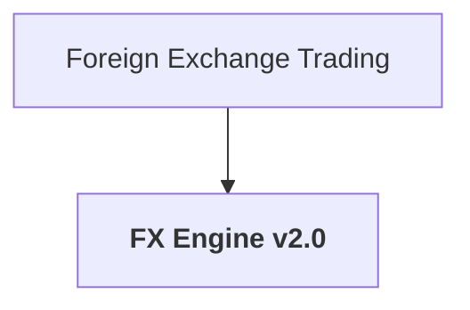

# RepoAsk Search & Ranking Skill

## Overview

RepoAsk indexes local Confluence and Jira documents into a metadata store.
Each document has a **structured keyword object** organised into six named categories,
each subdivided into `1gram` through `4gram` buckets.
A multi-layer scoring function ranks documents against a query using those buckets,
with keyword term-frequency counts amplifying scores when query terms match frequently-occurring tokens.

---

## 1. Keyword Categories (doc store layout)

```json
"keywords": {
  "title":      { "1gram": [], "2gram": [], "3gram": [], "4gram": [] },
  "structural": { "1gram": [], "2gram": [], "3gram": [], "4gram": [] },
  "semantic":   { "1gram": [], "2gram": [], "3gram": [], "4gram": [] },
  "bm25":       { "1gram": [], "2gram": [], "3gram": [], "4gram": [] },
  "kg":         { "1gram": [], "2gram": [], "3gram": [], "4gram": [] },
  "synonyms":   { "1gram": [], "2gram": [], "3gram": [], "4gram": [] }
}
```

| Category | Source | When populated |
|---|---|---|
| `title` | Sliding-window 1–4 grams of the document title | Initial sync |
| `structural` | `extractMdKeywords` — headings, bold, inline code, camelCase, PascalCase, SNAKE_CASE, ALL_CAPS, compound tokens (`FX-2024-00789` → 3gram), digit sequences | Initial sync |
| `semantic` | LLM annotation + summary n-grams | `generateMetadata` or `annotate` command |
| `bm25` | Top-N BM25-scored tokens from corpus-wide TF-IDF (k1=1.2, b=0.75) | `finalizeBm25KeywordsForDocuments` second pass |
| `kg` | Entity tokens intelligently extracted from the Mermaid knowledge graph labels and node IDs | Initial sync when `knowledgeGraph` is present |
| `synonyms` | Morphological expansions via `generateSynonyms` (suffix rules + Google 20k dict, pattern regex) | Rebuilt at sync, BM25 finalize, and every save |

**Gram classification** — compound tokens joined by `-_./+` are gram-classified by segment count, not space count:
`fx-2024-00789` has 3 segments → `3gram`.  
Space-separated phrases follow word count normally.

---

## 2. Keyword Pipeline

### 2a. Initial sync (`processDocument` / `processJiraIssue`)

```
HTML/Jira text
  → htmlToMarkdown / jiraTextToMarkdown
  → buildCategorizedKeywords(title, existingSummary, markdownContent, { kgMermaid })
      ├─ title:      tokenize(title, { includeNGrams: true })
      ├─ structural: extractMdKeywords(content)   ← markdown-it parse + code patterns
      ├─ semantic:   tokenize(summary, { includeNGrams: true }) + existingSemantic
      ├─ bm25:       [] (filled in second pass)
      ├─ kg:         extractMermaidEntityTokens(kgMermaid)  ← smart regex parsing of labels & node IDs
      └─ synonyms:   generateSynonyms(flattenCategorizedKeywords(baseKeywords))
  → writeDocumentFiles(storagePath, id, markdown, metadata)
```

### 2b. BM25 second pass (`finalizeBm25KeywordsForDocuments`)

1. Tokenize all docs with `tokenization2bm25` → build corpus-wide `dfMap`
2. Compute IDF for every token across N docs
3. For each target doc: score tokens by `idf × tf_bm25`, take top-N
4. Rebuild keywords with `bm25Keywords` filled, new `synonyms` regenerated

### 2c. AI annotation (`generateStoredMetadataById` / `annotateStoredDocument`)

- LLM returns `{ summary, keywords }` JSON
- New keywords are **appended** (not replaced) into the `semantic` slot via `mergeSemanticKeywords`
- `synonyms` category rebuilt from the full updated keyword set

### 2d. Manual save from sidebar (`updateStoredMetadataById`)

- Only the `semantic` slot is overwritten with the user's edited keywords
- All other categories (`title`, `structural`, `bm25`, `kg`) are **preserved**
- `synonyms` rebuilt after

---

## 3. `extractMdKeywords` (structural pipeline)

Uses **markdown-it** to parse the document and extract:

| Signal | Max n-gram |
|---|---|
| `h1` headings | 4-gram |
| `h2` headings | 3-gram |
| `h3`/`h4` headings | 2-gram |
| `h5`/`h6` headings | 1-gram |
| **bold** text | 3-gram |
| `` `inline code` `` spans | identifier split |
| Fenced code blocks | identifier split |
| Full raw document | compound + camelCase + ALL_CAPS + capital sequences |

Identifier splitting (`addCodeIdentifiers`):
- camelCase / PascalCase → word parts + 1–3 grams
- `ALLCAPS_UNDERSCORE` → lowercased + parts
- `snake_case` → parts + joined n-grams
- Compound tokens (`FX-2024-00789`) → whole token + individual segments + n-grams of segments
- Capital multi-word sequences (`"Risk Manager"`) → 2–4 gram phrases

---

## 3b. `extractMermaidEntityTokens` (KG extraction)

Intelligently parses Mermaid diagram syntax to extract meaningful entity tokens without diagram syntax noise:

1. **Quoted labels** — `["quoted text"]` → tokenized
2. **Bracket labels** — `[UnquotedLabel]` → tokenized
3. **CamelCase node IDs** — `SomeNodeId` → tokenized with camelCase splitting

For example, a Mermaid diagram containing:


Extracts: `foreign`, `exchange`, `trading`, `fx`, `engine`, `v2`, `0` (plus 2–4 gram combinations).

---

## 4. `wordsFromText` tokenizer

Three-phase extraction producing tokens for `buildNGrams`:

1. **Compound tokens** — regex `[A-Za-z0-9]+(?:[-_.+/][A-Za-z0-9]+)+`  
   Emits the whole compound (lowercase) + each segment (camel-split or digit as-is)
2. **Word tokens** — camelCase split, snake_case split, plain lowercase
3. **Pure digit sequences** — `\b\d{2,20}\b` (captures IDs, dates, codes)

Stop words are filtered; tokens must be 2–64 chars.

---

## 5. Scoring (`rankLocalDocuments`)

Reads `repoAsk.searchWeights` from VS Code configuration. Three additive scoring layers plus post-scoring filters:

### Layer 1 — WHOLE_QUERY_WEIGHTS
Entire query string matched (`.includes`) against: `id`, `title`, `type`, `tags`, all flattened keywords, `referencedQueries` (exact + partial).

| Field | Default weight |
|---|---|
| `id` | 50 |
| `title` | 35 |
| `referencedExact` | 40 |
| `referencedPartial` | 20 |
| `keywords` | 8 |
| `tags` | 6 |
| `type` | 4 |

### Layer 2 — TERM_WEIGHTS
Each 1-gram query token matched against the same fields.

| Field | Default weight |
|---|---|
| `title` | 5 |
| `referenced` | 4 |
| `id` | 3 |
| `keywords` | 1.5 |
| `tags` | 1.2 |
| `type` | 1 |

### Layer 3 — Keyword Weights (per category × per gram size)
Query n-grams (1–4) are built and matched against the doc's `keywords.{category}.{gramKey}` count-maps.
Each matching token contributes its stored **term frequency (count)** to the score, amplifying signals from frequently-occurring keywords.

```json
"keywords": {
  "title":      { "1gram": 10, "2gram": 20, "3gram": 30, "4gram": 40 },
  "structural": { "1gram": 5,  "2gram": 8,  "3gram": 12, "4gram": 16 },
  "semantic":   { "1gram": 4,  "2gram": 7,  "3gram": 10, "4gram": 14 },
  "bm25":       { "1gram": 6,  "2gram": 10, "3gram": 14, "4gram": 18 },
  "kg":         { "1gram": 3,  "2gram": 5,  "3gram": 8,  "4gram": 11 },
  "synonyms":   { "1gram": 2,  "2gram": 4,  "3gram": 6,  "4gram": 8  }
}
```

Longer n-grams get higher weights — a 4-gram hit in `bm25` scores 18 vs a 1-gram hit scoring 6. This applies to all six keyword categories including `kg`, which now carries rich entity tokens from the Mermaid diagram.

### Layer 4 — Referenced-Query Neighbor Boost
Cross-document boost for docs referenced in other queries (currently a stub, returns docs unchanged).

### Post-scoring Filters
1. Sort by score descending
2. Remove docs scoring below `topScore × topScoreThresholdRatio` (default 0.3)
3. Hard cap at `min(limit, maxSearchResults)` (default 5)

---

## 6. Keyword Storage Format (Count-Maps)

Since Layer 3 scoring uses term frequencies, keywords are now stored as count (frequency) maps:

```json
"keywords": {
  "title": {
    "1gram": { "fx": 3, "engine": 2 },
    "2gram": { "foreign exchange": 1, "fx engine": 2 }
  }
}
```

For example, a title "Foreign Exchange Engine FX FX" produces:
- `1gram: { foreign: 1, exchange: 1, engine: 1, fx: 2 }` ("fx" appears twice)
- `2gram: { foreign exchange: 1, exchange engine: 1, engine fx: 1, fx fx: 1 }` (including repeats)

When a query matches a token, the stored count is multiplied by the category weight to amplify scores for frequently-occurring keywords.

---

## 7. `generateSynonyms` output format

Returns an n-gram object (not a flat array):

```js
{ '1gram': string[], '2gram': string[], '3gram': string[], '4gram': string[] }
```

Expansion rules applied to flat input keywords:
- Structural regex pattern for compound/digit tokens (`e.g. [a-z]{2}-\d{4}-\d{5}`)
- Pattern-name tokens for matched patterns (`uuid`, `ticker`, `isin`, `date_iso`, …)
- camelCase → dashed form
- snake_case → dashed form
- Morphological suffix append/trim against Google 20k dictionary (plurals, -ing, -ed, -er, -tion, -ness, -able, …)
- Each bucket capped at 25 entries

---

## 8. Key files

| File | Purpose |
|---|---|
| `documentService/keywords.js` | `buildCategorizedKeywords`, `normalizeCategorizedKeywords`, `flattenCategorizedKeywords`, `mergeSemanticKeywords`, `categorizeByNGram`, `countGrams`, `extractMermaidEntityTokens` |
| `documentService/md2keywords.js` | `extractMdKeywords` — markdown-it structural extraction |
| `documentService/ranking.js` | `rankLocalDocuments` — full scoring pipeline |
| `documentService/sync.js` | `processDocument`, `processJiraIssue`, `finalizeBm25KeywordsForDocuments` |
| `documentService/annotation.js` | `annotateStoredDocument`, `generateAnnotationWithLlm` |
| `documentService/utils.js` | `generateStoredMetadataById`, `updateStoredMetadataById` |
| `documentService/tokenization2keywords/index.js` | `wordsFromText`, `buildNGrams`, `tokenize` |
| `documentService/tokenization2keywords/synonyms.js` | `generateSynonyms` |
| `documentService/tokenization2keywords/patternMatch.js` | `STOP_WORDS`, `PATTERNS`, `extract_capital_sequences` |
